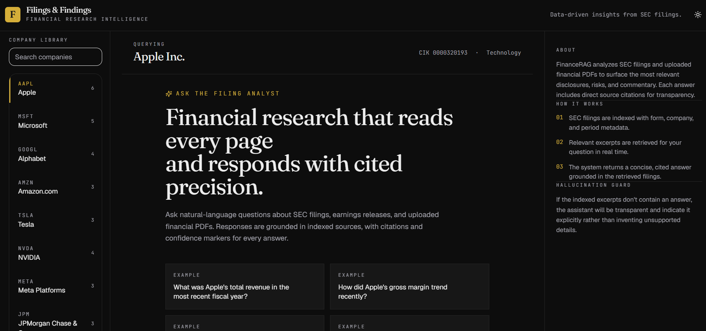
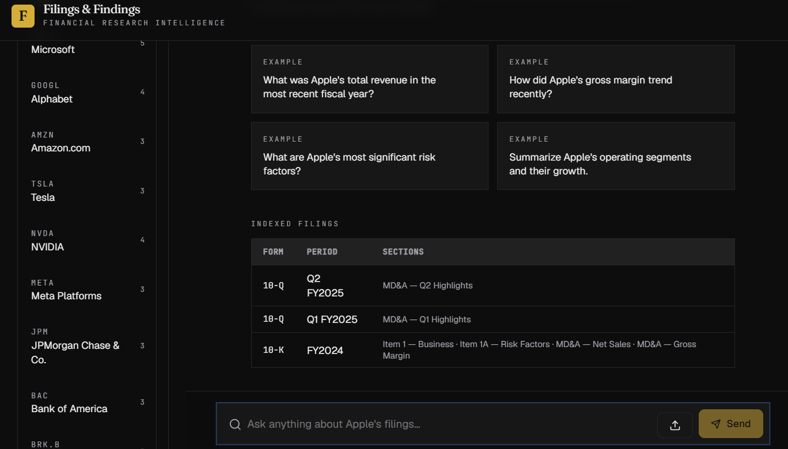
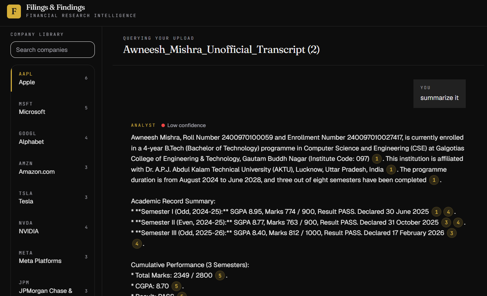
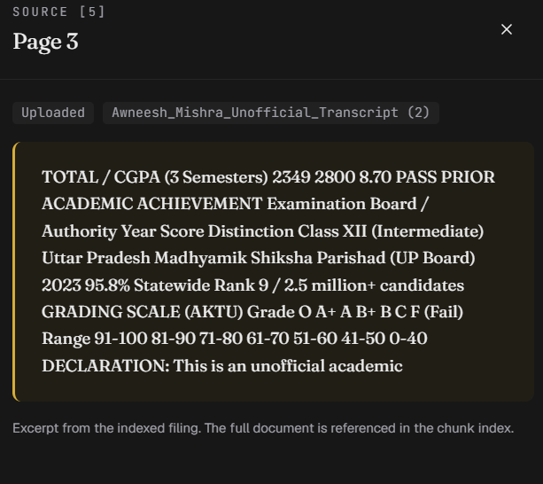

# 📈 FinanceRAG – AI-Powered Financial Research Assistant

FinanceRAG is a full-stack AI-powered financial research platform that enables users to ask natural language questions about companies and financial reports. It leverages a Retrieval-Augmented Generation (RAG) pipeline to retrieve relevant financial context before generating intelligent, context-aware responses using Google's Gemini API.

The project combines a React.js frontend with a FastAPI backend to provide an interactive chatbot capable of simplifying financial analysis and improving information retrieval from curated financial documents.

---

## 🚀 Features

- 💬 AI-powered financial chatbot
- 📄 Retrieval-Augmented Generation (RAG) pipeline
- 📚 Context-aware document retrieval
- 🧩 Financial document chunking and indexing
- 🤖 Google Gemini API integration
- 📊 Company-specific financial insights
- ⚡ FastAPI backend with RESTful APIs
- 🎨 Responsive React.js frontend
- 🔍 Curated financial knowledge base
- 🔄 Real-time AI-generated responses

---

## 🏗️ Project Architecture

```
                 User Query
                      │
                      ▼
             React.js Frontend
                      │
                      ▼
              FastAPI Backend
                      │
          ┌───────────┴───────────┐
          │                       │
          ▼                       ▼
 Financial Document Index      Prompt Builder
          │                       │
          └───────────┬───────────┘
                      ▼
             Google Gemini API
                      │
                      ▼
           Context-Aware Response
                      │
                      ▼
                React Frontend
```

---

## 🛠️ Tech Stack

### Frontend
- React.js
- JavaScript (ES6+)
- HTML5
- CSS3
- CRACO

### Backend
- Python
- FastAPI
- Uvicorn

### AI & RAG
- Google Gemini API
- Retrieval-Augmented Generation (RAG)
- Prompt Engineering
- Document Chunking
- Context Retrieval

### Development Tools
- Node.js
- npm
- Git
- VS Code
- Python Virtual Environment (venv)

---

## 📂 Project Structure

```
FinanceRagSystem/
│
├── frontend/
│   ├── public/
│   ├── src/
│   ├── package.json
│   └── ...
│
├── backend/
│   ├── server.py
│   ├── requirements.txt
│   ├── curated_data/
│   ├── uploads/
│   └── ...
│
└── README.md
```

---

## ⚙️ Installation

### Clone the repository

```bash
git clone https://github.com/awneeshmishra433/FinanceRagSystem.git
cd FinanceRagSystem
```

---

## Backend Setup

```bash
cd backend

python -m venv venv

# Windows
venv\Scripts\activate

pip install -r requirements.txt

uvicorn server:app --reload
```

Backend runs at:

```
http://127.0.0.1:8000
```

---

## Frontend Setup

```bash
cd frontend

npm install --legacy-peer-deps

npm start
```

Frontend runs at:

```
http://localhost:3000
```

---

## Environment Variables

Create a `.env` file inside the backend directory.

```env
GOOGLE_API_KEY=YOUR_GEMINI_API_KEY

# Add any additional environment variables required by the project
```

---

## How It Works

1. User submits a financial question.
2. The backend processes the query.
3. Relevant financial document chunks are retrieved.
4. Retrieved context is combined with the user query.
5. Google Gemini generates a context-aware response.
6. The answer is displayed in the React chat interface.

---

## Example Questions

- What are Apple's primary revenue sources?
- Summarize Microsoft's latest annual report.
- Compare Tesla's financial performance with NVIDIA.
- What are Amazon's major business segments?
- Explain the recent financial trends of Alphabet.

---

## REST API Endpoints

| Method | Endpoint | Description |
|---------|----------|-------------|
| GET | `/api/companies` | List available companies |
| GET | `/api/companies/{ticker}/filings` | Retrieve company filings |
| POST | `/api/query` | Ask AI financial questions |
| POST | `/api/upload` | Upload financial documents |
| GET | `/api/example-questions/{ticker}` | Sample questions |

---

## Key Concepts Demonstrated

- Retrieval-Augmented Generation (RAG)
- Large Language Models (LLMs)
- REST API Development
- Prompt Engineering
- Context-Aware AI
- Financial Information Retrieval
- Document Processing
- Client-Server Architecture

---

## Future Improvements

- Vector database integration (FAISS / ChromaDB)
- Semantic embedding search
- User authentication
- Conversation history
- Multi-document retrieval
- Real-time stock market APIs
- Advanced financial analytics dashboard
- Citation-aware responses
- Cloud deployment (AWS / Azure / GCP)
- Docker containerization

---

## Screenshots










## License

This project is intended for educational and portfolio purposes.

---

## Author

**Awneesh Mishra**

LinkedIn: *https://www.linkedin.com/in/awneesh-mishra-530bab377*

GitHub: *https://github.com/awneeshmishra433*

---

⭐ If you found this project interesting, consider giving it a star!